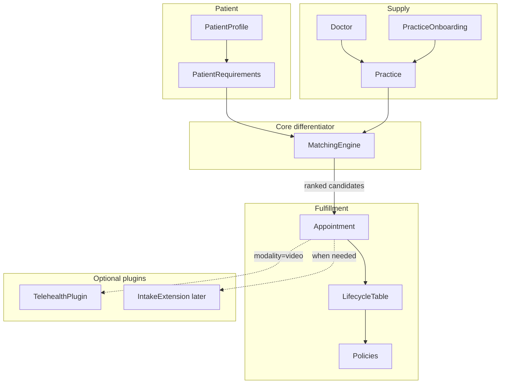
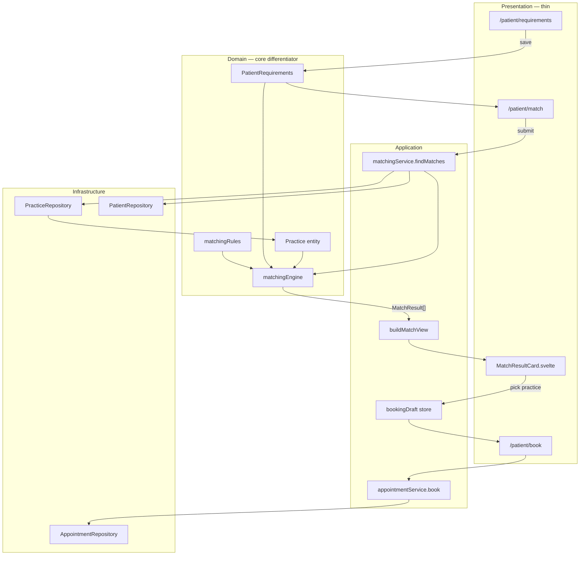
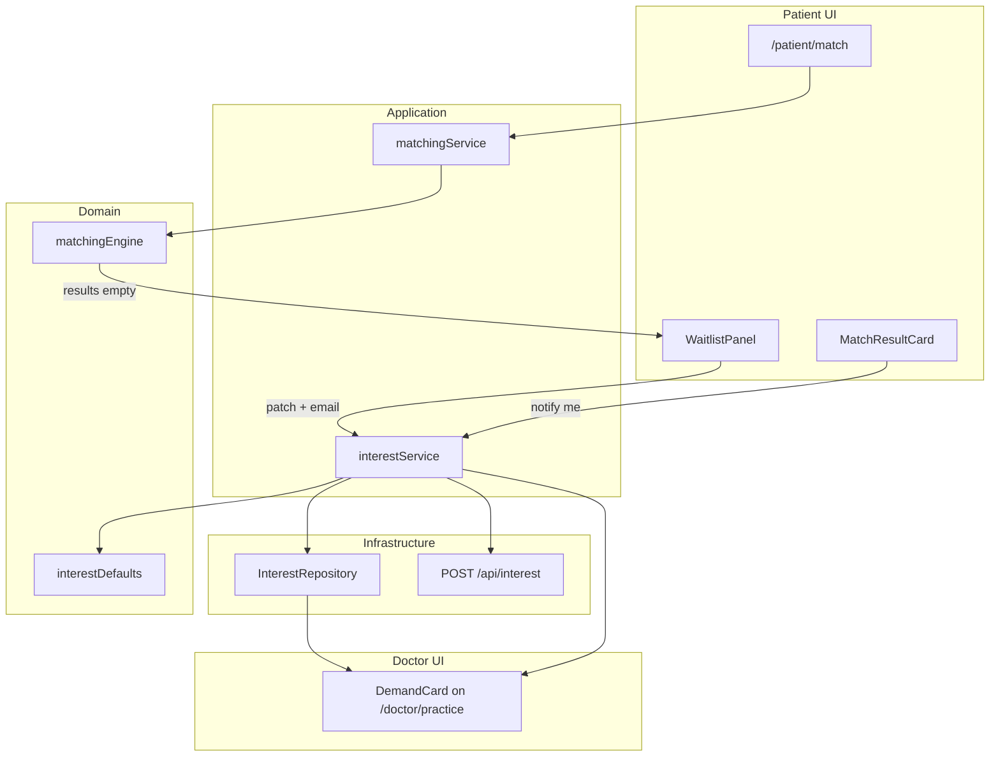

# Svelte + TypeScript MVP (Netlify + Tauri v2)

**Product hypothesis:** international patients find the right doctor/practice better than Doctolib — not "can we do video calls."

**Architectural principle:** protect the **matching domain** from UI and external systems (Doctolib links, Agora). Keep appointments boring until lifecycle complexity proves otherwise.

**Simplicity principle:** layers communicate by passing **plain objects**. One shared **`safeMerge(base, patch)`** handles partial updates everywhere — no bespoke merge logic per feature.

**File-count rule:** prefer merging related logic in one context into a single module when under ~150 LoC and SoC stays clear (e.g. notify + service, policies + registry). Do not create a new file per tiny helper.

---

## Object communication: `safeMerge` (reuse everywhere)

Most cross-layer updates are the same operation: *take what we have, apply a partial patch, validate what's missing.*

One utility in [`src/lib/safeMerge.ts`](src/lib/safeMerge.ts) — used by repos, stores, services, forms, localStorage hydrate:

```ts
/** JSON-safe merge: plain objects only; undefined patch keys are skipped (don't erase). */
export function safeMerge<T extends object>(base: T, patch: Partial<T>): T {
  const out = { ...base };
  for (const [k, v] of Object.entries(patch)) {
    if (v === undefined) continue;
    if (v !== null && typeof v === 'object' && !Array.isArray(v) && typeof (base as any)[k] === 'object') {
      (out as any)[k] = safeMerge((base as any)[k] ?? {}, v as object);
    } else {
      (out as any)[k] = v;
    }
  }
  return out;
}

/** After merge — what's still missing for a required-key list? */
export function missingRequired(obj: object, keys: readonly string[]): string[] {
  return keys.filter((k) => {
    const v = (obj as Record<string, unknown>)[k];
    return v === undefined || v === null || v === '';
  });
}
```

**Pattern at every boundary:**

```text
Form step submits partial object
  → store/repo: current = safeMerge(defaults, stored)
  → store/repo: next    = safeMerge(current, patch)
  → save(next) → subscribers notify UI

Service receives object
  → deps merged = safeMerge(defaultContext, incoming)
  → domain fn(deps merged) → result object out
```

**Reused for:**

| Use | Base | Patch from |
|-----|------|------------|
| Patient requirements | `patientRequirementsDefaults` | each form step, language prefs |
| Practice profile | `practiceProfileDefaults` | `/doctor/practice` form |
| Booking draft | `{}` | match pick + slot selection |
| Appointment update | existing appointment | `appointmentService.confirm` etc. |
| Policy / lifecycle context | `{ now, actor }` | caller partial ctx |
| localStorage load | typed defaults | `JSON.parse` (sanitize via merge) |

**No in-place mutation.** Repos always `safeMerge` → `save` → `notify`. Services return new objects; stores replace atomically.

Readiness gates simplify to one line after merge:

```ts
const reqs = safeMerge(patientRequirementsDefaults, stored);
const missing = missingRequired(reqs, MATCH_REQUIRED_KEYS);
const ready = missing.length === 0;
```

Same for practice supply side — no separate `isPatientReadyForMatch` / `isPracticeReadyForMatch` machinery beyond `missingRequired`.

---

## What changed (vs prior plan)

| Prior (over-built for MVP) | Revised (MVP-aligned) |
|---|---|
| Visit aggregate + event FSM | **Lifecycle table** — one readable file, human-editable |
| CQRS command/query handlers | **Three boring services** — `matchingService`, `appointmentService`, `practiceService` |
| Scheduling / Intake / Telehealth as equal pillars | **Matching** is core; intake = patient requirements; telehealth = plugin |
| Encrypted anamnesis v1 | **Patient requirements** (language, specialty, insurance, location, new patient) |
| Doctor-centric VisitHub | **Practice + Doctor** models; patient may match to practice, doctor assigned later |

**Still keep:** no `visitWorkflow` god object; **policies** as pure functions; hexagonal ports for repos and telehealth; **`allowedActions`** for dumb UI rendering.

---

## Decisions nailed down (pre-implementation)

These address the gaps in the prior CQRS/aggregate sketch. **MVP does not use CQRS or a Visit aggregate** — but the same principles apply to what we *do* build.

### 1. Single owner of appointment state (no split FSM)

**Problem:** aggregate emits events → separate FSM applies them = two owners of state.

**MVP answer:** the **lifecycle table + `lifecycleEngine`** is the *only* owner. Transitions are validated and resolved in one place:

```ts
// lifecycleEngine.transition(currentStatus, action, context) → newStatus
// Table defines valid edges; engine runs policy checks; returns next state.
// appointmentService never mutates status directly.
```

**Evolution answer:** if/when we introduce an `Appointment` aggregate class, the lifecycle table moves **inside** it as a private transition map — `confirm()` guards and produces new state internally. We do **not** reintroduce a separate applying-FSM beside the aggregate.

### 2. Svelte store invalidation (concrete, not hand-wavy)

**MVP mechanism:** repository **push subscription** — no polling, no SSE, no eventual consistency.

```ts
// ports/AppointmentRepository.ts
interface AppointmentRepository {
  getAll(): Appointment[];
  get(id: string): Appointment | null;
  save(appt: Appointment): Appointment;
  subscribe(listener: (all: Appointment[]) => void): () => void;
}

// adapters/appointmentLocalRepo.ts — save() persists + notifies all listeners

// stores/appointments.ts
export const appointments = readable<Appointment[]>([], (set) =>
  appointmentRepo.subscribe(set)
);
```

**Write path:**

```text
UI click → appointmentService.confirm(id) → repo.save(updated)
         → repo notifies subscribers → Svelte store updates → UI re-renders
```

**Read path for doctor detail:** derive view from store + pure helpers:

```ts
$: view = buildAppointmentView($appointments.find(a => a.id === id), actor, now);
// view.allowedActions computed fresh on each store tick
```

**Optimistic updates (optional):** UI wrapper may patch local store before `save`, roll back on thrown error — still one reconcile path via `save` success/failure.

**Not in MVP:** separate read-model projections, cache invalidation tags, or CQRS query handlers.

### 3. Cross-context side effects (confirm ↔ telehealth)

**MVP reality:** Agora needs **no provisioning on confirm**. Current app already works this way:

- Channel name is deterministic at book time: `channelFor(id) → appt_${id}` ([`public/js/store/appointments.js`](public/js/store/appointments.js))
- Token minted **on join** via `/api/video/token` ([`backend/app.js`](backend/app.js))
- Virtual Agora room appears when first participant joins

So `appointmentService.confirm()` has **zero telehealth calls** in MVP. Telehealth is join-time only, gated by `mayJoinVideo` policy.

**When side effects are needed later** (SMS reminder, calendar hold, recording consent — not Agora room create):

Use an **in-process hook registry**, not a distributed event bus and not direct calls from appointment code to telehealth internals:

```ts
// application/transitionHooks.ts
type TransitionHook = (action: ActionId, appt: Appointment) => void | Promise<void>;

export function registerTransitionHook(plugin: string, hook: TransitionHook) { ... }

// appointmentService.confirm — after repo.save succeeds:
await runTransitionHooks('confirm', saved);

// plugins/telehealth/register.ts — only if that plugin needs post-confirm work
registerTransitionHook('telehealth', async (action, appt) => { ... });
```

Rules:

- Hooks run **after** successful persist (appointment state is source of truth)
- Hook failure logs + surfaces toast; does **not** roll back appointment state (avoid distributed transaction pretend)
- No handler imports telehealth module directly — avoids rebuilding the facade inside a command

**Distributed event bus / outbox:** only when a real backend + async workers exist. Explicitly out of MVP scope.

### 4. What “CQRS-lite” means *if we adopt it later*

Not used in MVP. If appointment complexity forces a split:

| In scope | Out of scope |
|----------|--------------|
| Separate command functions vs query/view builders | Event sourcing |
| Single storage (localStorage → Postgres) | Separate read-model DBs |
| **Synchronous** read-after-write | Eventual consistency / projections lag |

Nobody should build read-model projections expecting delayed consistency — reads always hit the same repo the commands wrote to.

---

## Domain map (MVP)



---

## Bounded contexts (priority order)

### 1. Matching — **core domain**

Owns the data and rules that make YourHealthMatch different:

- Patient requirements: language, specialty, insurance (GKV/PKV/private), location, new-patient flag, preferred window
- Practice attributes: languages, specialties, insurance accepted, location, accepting new patients, availability slots, external booking link (Doctolib)
- **Matching engine:** score + filter + rank candidates

```ts
// domain/matching/matchingRules.ts — pure, testable
type MatchInput = { requirements: PatientRequirements; practices: Practice[] };
type MatchResult = { practiceId: string; doctorId?: string; score: number; reasons: string[] };

function findMatches(input: MatchInput): MatchResult[]
```

**First architecture task:** define the exact patient + practice fields needed for a match Doctolib cannot make. Document in `domain/matching/README.md` (field glossary, not code ceremony).

### Match defaults — patient ↔ practice parity (critical for v1)

The **beginning of the patient flow is the product.** Whatever the patient fills in before matching must be **enough to score against a fully completed practice profile** — no hidden fields deferred to book/confirm/dashboard.

**Two default objects + one required-key list** (not a heavy schema framework):

```ts
// domain/matching/matchDefaults.ts
export const patientRequirementsDefaults = {
  language: '',
  specialty: '',
  insurance: '' as 'GKV' | 'PKV' | 'private' | '',
  location: '',
  newPatient: null as boolean | null,
  preferredWindow: '',
  modality: 'either' as 'in_person' | 'video' | 'either',
};

export const practiceProfileDefaults = {
  languages: [] as string[],
  specialties: [] as string[],
  insuranceAccepted: [] as string[],
  location: '',
  acceptingNewPatients: null as boolean | null,
  availabilitySlots: [] as { date: string; time: string }[],
  weeklyHours: { mon: ['09:00','17:00'], tue: ['09:00','17:00'], /* … */ } as WeeklyHours,  // fallback generator for openSlots
  modalities: ['in_person'] as string[],
  bookingChannel: 'direct' as 'doctolib' | 'direct' | 'phone',
};

export const MATCH_REQUIRED_PATIENT = ['language', 'specialty', 'insurance', 'location', 'newPatient'] as const;
export const MATCH_REQUIRED_PRACTICE = ['languages', 'specialties', 'insuranceAccepted', 'location', 'acceptingNewPatients'] as const;
```

Field glossary (labels, UX copy) lives in `domain/matching/README.md` — not in code generators.

**Forms stay simple.** `RequirementsForm.svelte` submits a partial patch; route handler merges:

```ts
patientStore.update((cur) => safeMerge(patientRequirementsDefaults, safeMerge(cur, formPatch)));
```

Doctor `/doctor/practice` — same pattern with `practiceProfileDefaults`.

### Completeness gates (both sides)

After merge, one check:

```ts
missingRequired(safeMerge(defaults, obj), MATCH_REQUIRED_PATIENT)  // → [] means ready
```

| Gate | Rule |
|------|------|
| **Patient** | `/patient/match` blocked while `missingRequired(...).length > 0` |
| **Practice** | Candidate pool = practices where onboarding is `available_for_matching` **and** practice merge passes `MATCH_REQUIRED_PRACTICE` |
| **Engine** | receives already-merged objects; never scores raw partials |

**Patient flow order (match-first):**

```text
/patient/language     → patch: { language } merged into requirements
/patient/requirements → patch remaining fields — blocking gate via missingRequired
/patient/match        → matchingService.findMatches(merged requirements)
/patient/book         → safeMerge bookingDraft with { practiceId, slot }
/patient/book/confirm → appointmentService.book(safeMerge(draft, { confirmed: true }))
```

**Nothing match-critical at the end.** Book/confirm only merge `practiceId`, `doctorId?`, `slot` onto the already-merged requirements snapshot in `bookingDraft`.

```ts
type BookingDraft = ReturnType<typeof buildBookingDraft>; // merged object, not a class
// built via safeMerge({}, { requirements, practiceId, slot, matchScore })
```

### Doctor side must complete the mirror

```text
practiceService.saveProfile(patch)
  → merged = safeMerge(practiceProfileDefaults, safeMerge(existing, patch))
  → repo.save(merged)
  → eligible for matching when missingRequired(merged, MATCH_REQUIRED_PRACTICE) is empty
```

**Integration test (definition of ready):**

```text
Given: safeMerge(practiceProfileDefaults, completePracticePatch)
And:   safeMerge(patientRequirementsDefaults, completePatientPatch)
When:  matchingService.findMatches()
Then:  at least one MatchResult with score > 0 and non-empty reasons[]
```

### 2. Practice + Doctor — **supply network**

Explicit models (do not collapse into "doctor"):

```text
Patient searches → Practice (languages, insurance, specialty, location)
                        ├── Doctor(s)
                        ├── Availability
                        └── bookingChannel: doctolib | direct | phone
Patient books → Appointment → assigned Doctor (optional at book time)
```

**Practice onboarding pipeline** (supports sales, not just UI):

```text
discovered → contacted → interested → onboarded → verified → available_for_matching
```

MVP: stub states in `practiceService`; localStorage seed data for demo practices.

### 3. Appointment — **simple until proven complex**

No aggregate class, no CQRS, no event bus for MVP.

`appointmentService` exposes plain methods:

```ts
book(input)      // creates requested
confirm(id)      // requested → confirmed
reject(id)       // requested → rejected
cancel(id, actor)
complete(id)
markNoShow(id)
```

All transitions go through one gate: the **lifecycle table**.

### 4. Telehealth — **plugin, not pillar**

Only when `appointment.modality === 'video'` and lifecycle allows join:

- `telehealthPolicy.mayJoin(appointment, now, actor)` — pure
- Agora module: token client + session + `VideoCallPanel.svelte`
- Lives in `src/lib/plugins/telehealth/` — can be feature-flagged off without touching matching

### 5. Intake — **deferred; requirements only for MVP**

Replace "encrypted anamnesis v1" with **PatientRequirements** collected during match flow.

Later extension point: `plugins/intake/` with its own lifecycle hooks — do not design it now.

---

## Human-readable lifecycle (the extensibility mechanism)

**Goal:** a founder or clinician can add a state or transition by editing one table — no aggregate refactor, no new command handler files.

Single source of truth: [`src/lib/domain/appointment/appointmentLifecycle.ts`](src/lib/domain/appointment/appointmentLifecycle.ts)

```ts
/**
 * Appointment lifecycle — edit states/transitions here.
 * Tests in appointmentLifecycle.test.ts guard against typos.
 */
export const appointmentLifecycle = defineLifecycle({
  states: {
    requested:  { label: 'Requested',  badge: 'pending' },
    confirmed:  { label: 'Confirmed',  badge: 'confirmed' },
    completed:  { label: 'Completed',  badge: 'done' },
    cancelled:  { label: 'Cancelled',  badge: 'cancelled' },
    rejected:   { label: 'Declined',   badge: 'cancelled' },
    no_show:    { label: 'No show',    badge: 'cancelled' },
  },
  transitions: [
    { action: 'confirm',  from: 'requested', to: 'confirmed', by: ['doctor'] },
    { action: 'reject',   from: 'requested', to: 'rejected',  by: ['doctor'] },
    { action: 'cancel',   from: ['requested', 'confirmed'], to: 'cancelled',
      by: ['patient', 'doctor'], policy: 'cancellation' },
    { action: 'complete', from: 'confirmed', to: 'completed', by: ['doctor'] },
    { action: 'no_show',  from: 'confirmed', to: 'no_show',   by: ['doctor'] },
    // Add future transitions as rows — e.g. reschedule, payment_pending
  ],
});
```

**Runtime API** (small, stable — table changes don't touch callers):

```ts
// domain/appointment/lifecycleEngine.ts
transition(state, action, context): Result<NewState, LifecycleError>
allowedActions(appointment, actor, now): ActionId[]  // powers doctor UI buttons
canTransition(from, action, context): boolean
```

**Policies** stay separate pure functions referenced by name in the table:

```ts
// domain/appointment/policies.ts
cancellation(appointment, actor, now): PolicyResult   // 6h rule from clinicPolicy
mayJoinVideo(appointment, now, actor): PolicyResult // telehealth plugin gate
```

### Policies registry — easily extendable (same pattern as lifecycle table)

Policies use the **same extensibility model** as the lifecycle table: add a function + register it by name. No scattered `if` chains in UI or services.

```ts
// domain/appointment/policyRegistry.ts
export const policies = {
  cancellation,
  mayJoinVideo,
  // add future rules here — e.g. paymentRequired, insuranceVerified
} as const satisfies Record<string, PolicyFn>;

export type PolicyName = keyof typeof policies;

export function runPolicy(name: PolicyName, ctx: PolicyContext): PolicyResult {
  return policies[name](ctx);
}
```

**Lifecycle table references policies by string name:**

```ts
{ action: 'cancel', ..., policy: 'cancellation' }   // lifecycleEngine looks up policies['cancellation']
```

**To add a new rule:**

1. Write pure function in `policies.ts` (or `plugins/*/policy.ts` for plugin-specific rules)
2. Add to `policyRegistry` object
3. Reference `'policyName'` in lifecycle transition row **or** call directly from `matchingEngine` / `buildAppointmentView`
4. Add test in `policies.test.ts` — one file, one matrix

Plugin policies (e.g. telehealth) register without touching appointment core:

```ts
// plugins/telehealth/register.ts
import { registerPolicy } from '$lib/domain/appointment/policyRegistry';
registerPolicy('mayJoinVideo', mayJoinVideo);
```

**Rules:** policies are pure (no repo access); callers pass data in. Same as lifecycle — human-readable, table-driven, test-guarded.

Doctor queue / appointment detail UI:

```ts
const actions = allowedActions(appointment, { role: 'doctor' }, now);
// ['confirm', 'reject', 'cancel'] — render buttons from this list
// onClick → appointmentService.confirm(id) — service validates via lifecycleEngine
```

### When to evolve beyond the table

Add an `Appointment` aggregate **only when** you need several of:

- rescheduling with audit trail
- payment / insurance verification gates
- recurring visits
- multi-step intake blocking confirmation
- cross-context sagas (e.g. refund on cancel)

**Migration rule:** lifecycle table becomes the aggregate's **private** transition map; FSM logic lives **inside** `confirm()` / `cancel()` methods — never beside the aggregate. UI still calls `allowedActions()`; hook registry still handles plugin side effects.

---

## Application layer: three services (not CQRS)

| Service | Responsibility |
|---------|----------------|
| `matchingService` | `findMatches(requirements)`, explain scores |
| `interestService` | `registerInterest(patch)`, `aggregateDemand()` — waitlist + notify + see demand |
| `appointmentService` | book, confirm, cancel, … — all via lifecycleEngine |
| `practiceService` | CRUD profile, onboarding state transitions |

```ts
// application/appointmentService.ts
export async function confirmAppointment(id: string, deps: Deps) {
  const appt = deps.appointmentRepo.get(id);
  const result = lifecycleEngine.transition(appt.status, 'confirm', { actor: deps.actor, now: deps.clock.now() });
  if (!result.ok) throw result.error;
  const saved = deps.appointmentRepo.save({ ...appt, status: result.value });
  await runTransitionHooks('confirm', saved, deps.hooks); // no-op in MVP unless plugins registered
  return saved; // repo.save notifies store subscribers
}
```

No `BookVisit.ts` / `ConfirmVisit.ts` handler files until volume justifies it.

---

## Matching: where it lives (vs fourSome)

**Short answer:** matching does **not** live in a UI component. It lives in **`domain/matching/`** (pure engine) + **`application/matchingService.ts`** (orchestration). Svelte routes/components are thin collectors and renderers — same separation fourSome uses, adapted for client-first MVP.

### fourSome layering (reference)

| Layer | fourSome | YourHealthMatch MVP |
|-------|----------|---------------------|
| **Presentation** | `frontend/app/onboarding.tsx`, `chat.tsx` — forms + chat, no scoring | `/patient/requirements`, `/patient/match` — forms + result list, no scoring |
| **Application** | `app.py` tool dispatch → `tasks.py` Celery → `get_matches()` | `matchingService.findMatches()` — loads repos, calls engine |
| **Domain** | `matching_logic/matching_logic_mvp.py` — SQL scoring, filters, threshold 0.60 | `matchingEngine.ts` + `matchingRules.ts` — rule/score matrix, pure functions |
| **Infrastructure** | Postgres + pgvector embeddings, `database_operations.py` | `PracticeRepository`, `PatientRepository` (localStorage → API later) |

**Key similarity:** fourSome's chat UI never scores — it sends requirements upstream; `matching_logic_mvp.py` owns the algorithm. YHM follows the same rule: **`MatchResultCard.svelte` displays `reasons[]` and `score`; it never computes them.**

**Key difference (MVP):** fourSome uses LLM tool orchestration + async Celery + vector embeddings. YHM MVP uses **deterministic rule-based scoring** (language, specialty, insurance, location, new-patient) — testable without ML. Vector/LLM matching is an evolution path, not v1.

### Where each piece lives in YHM

```text
NOT HERE                          HERE (core)
────────                          ────────────
MatchResultCard.svelte            domain/matching/matchingEngine.ts   ← scoring + filtering
  (renders score, reasons)        domain/matching/matchingRules.ts    ← weights, thresholds (human-editable like lifecycle table)
/patient/match/+page.svelte       application/matchingService.ts      ← findMatches(): load supply, call engine
  (form submit, loading state)    application/buildMatchView.ts       ← optional: map results → UI DTO + explain text
requirements form fields          domain/patient/PatientRequirements.ts
stores/matchResults.ts            ports/PracticeRepository.ts         ← supply-side data
  (last search results cache)     domain/practice/Practice.ts
```

**`matchResults` store** holds the last search output for navigation (requirements → match → book). It is **not** the matching engine — same as fourSome storing meetup IDs in Firebase after Celery finishes, not computing matches in the client store.

### Information flow (matching path)



**Step-by-step:**

```text
1. /patient/requirements
   → user fills language, specialty, insurance, location, new-patient flag
   → saved as PatientRequirements (store or patientRepo)

2. /patient/match  (+page.svelte)
   → onMount or "Find matches" click:
       results = matchingService.findMatches(requirements, { practiceRepo, clock })
   → matchResults store.set(results)   // cache for back-navigation
   → render MatchResultCard per result (score, reasons[], practice name, doctors)

3. User picks a result
   → bookingDraft.set({ practiceId, doctorId?, matchScore, requirements })
   → goto /patient/book

4. /patient/book → /patient/book/confirm
   → appointmentService.book(draft)    // separate context — matching is done
   → appointmentRepo.save → appointments store updates
```

**Matching stops at step 2.** Booking/confirm/lifecycle are downstream — matching does not know about appointments.

### Comparison to fourSome trigger path

```text
fourSome:
  chat message → LLM picks matching_logic tool → Celery worker → matching_logic_mvp.py
  → writes meetups + pre_send_invites → UI shows GiGi response + explore tab

YHM MVP:
  requirements form → matchingService.findMatches → matchingEngine.ts
  → returns ranked MatchResult[] → UI list → user picks → appointmentService.book
```

Later YHM can add fourSome-like async/LLM matching behind the **same port**:

```ts
// ports/MatchingEnginePort.ts — engine is swappable
interface MatchingEnginePort {
  findMatches(input: MatchInput): MatchResult[];
}
// adapters/ruleBasedEngine.ts  ← MVP
// adapters/vectorEngine.ts     ← later (pgvector like fourSome)
// matchingService always calls the port — UI unchanged
```

---

## Survey-derived features (ido healthcare survey)

**Sources:**
- [`ido-app/ido-core/src/data/surveys/international-students-healthcare-de-survey.ts`](../../ido-app/ido-core/src/data/surveys/international-students-healthcare-de-survey.ts) (+ follow-up v1)
- [`ido-app/ido-core/supabase/functions/join-waitlist/index.ts`](../../ido-app/ido-core/supabase/functions/join-waitlist/index.ts) — reference impl for email waitlist
- [`ido-app/ido-core/docs/features/surveys/mvp-blocks.md`](../../ido-app/ido-core/docs/features/surveys/mvp-blocks.md) — `doctor_fit_check`, `medical_help` blocks

### Full feature inventory (from survey → product)

| # | Survey signal | Question(s) | Product feature | YHM priority |
|---|---------------|-------------|-----------------|--------------|
| **W1** | Waitlist for doctor-finder | Q21f (Yes/Maybe/No) | Join waitlist when no supply / pilot city | **P0** |
| **W2** | Email for early access | Q24, Q23f (required) | Email capture + interest record | **P0** |
| **W3** | Free beta intent | Q22f | Beta flag on interest record; splash CTA | **P0** |
| **W4** | See demand (supply side) | Q21f + Q10f pain ("not accepted as new patient") | Doctor dashboard: patient interest counts by specialty/language/location | **P0** |
| **W5** | Notify when match appears | Q21f + cold-start pattern (language survey Q30) | `notifyWhenMatched` on interest; email when practice joins pool | **P1** |
| **W6** | App early-access waitlist | thankYouCta → `/signup` | Splash / role-picker waitlist (product-level, not match-specific) | **P1** |
| **M1** | Doctor search filters | Q18, Q18f | Already core — `matchDefaults` + `matchingEngine` | **P0** (in plan) |
| **M2** | Hausarzt finder | Q10h `doctor_fit_check` | Port PLZ/distance ranking from ido `doctor-fit/` as matching enricher | **P1** |
| **M3** | Top MVP: online booking | Q19f, Q20f bundle B | Already core — `appointmentService.book` + lifecycle | **P0** (in plan) |
| **M4** | MVP bundle A (list + KV link) | Q20f | Match results link out to Doctolib/KV — `bookingChannel` on Practice | **P1** |
| **I1** | Platform likelihood | Q20 (1–5) | Optional post-match feedback — analytics only | **P2** |
| **I2** | Willingness to pay | Q21, Q21a, Q21b | Research / pricing page — not MVP product | **P3** |
| **P1** | Patient feedback on practices | Q27, Q26 | Structured feedback plugin (wait time, punctuality) — not star ratings | **P2** |
| **P2** | Care-path orientation | Q25, Q26, beyond-search options | "GP vs 116117 vs ER" guide route | **P2** |
| **P3** | AI medical-help summary | Q24mvp `medical_help` | Optional intake plugin — deferred | **P3** |
| **P4** | Telemedicine | Q19 options | Telehealth plugin — already in plan | **P1** (in plan) |
| **P5** | Insurance counter scripts | Q20f bundle C | Static content / scripts page | **P2** |

### P0 — implement in MVP (waitlist + notify + see interest)

These directly answer what the healthcare survey asked for and fit the existing architecture without CQRS.

#### 1. `interestService` — fourth boring service

```ts
// domain/interest/interestDefaults.ts
export const interestDefaults = {
  id: '',
  email: '',
  requirements: patientRequirementsDefaults,  // frozen snapshot via safeMerge
  practiceId: null as string | null,         // null = city-wide wait; set = express interest in one practice
  intent: 'waitlist' as 'waitlist' | 'beta' | 'notify_match',
  betaInterest: null as 'yes' | 'maybe' | 'no' | null,  // Q22f parity
  createdAt: '',
  notifiedAt: null as string | null,
};

// application/interestService.ts
registerInterest(patch)   // safeMerge(interestDefaults, patch) → repo.save → optional POST /api/interest
listInterestForPractice(practiceId)
aggregateDemandByPractice()  // { specialty, language, location } → count — for doctor dashboard
```

**Reuse `safeMerge`** — same pattern as requirements and practice profile. Form submits `{ email, intent, practiceId? }`; service merges with merged requirements snapshot.

#### 2. Patient UI integration points

| Screen | When | UI |
|--------|------|-----|
| `/patient/match` — empty results | `findMatches()` returns `[]` or all below threshold | **WaitlistPanel**: "No matches in Greifswald yet" + email + Q21f Yes/Maybe + `registerInterest({ intent: 'waitlist' })` |
| `/patient/match` — low results | &lt; 3 results | Optional banner: "Get notified when more practices join" |
| `MatchResultCard.svelte` | Always on each result | **"Notify me when a slot opens"** → `registerInterest({ practiceId, intent: 'notify_match' })` |
| `/patient/book/confirm` success | After book | "We'll email you when the doctor confirms" (sets expectation — Q26 post-booking uncertainty) |

Route guard unchanged — interest is **after** match attempt, not a substitute for requirements.

#### 3. Doctor UI — see interest (supply signal)

| Screen | What doctor sees |
|--------|------------------|
| `/doctor/practice` | Demand card: "**8 patients** waiting for Dermatology · Arabic · GKV in Greifswald" (from `aggregateDemandByPractice`) |
| `/doctor/dashboard` | Secondary widget: interest breakdown — drives onboarding completion |
| Practice onboarding | Prompt: "Complete your profile to appear in matches — **N patients already waiting**" |

This closes the loop survey respondents asked for: patients signal demand before supply exists; practices see it.

#### 4. Backend (Netlify, mirror ido `join-waitlist`)

```text
POST /api/interest   → validate email, upsert interest row (Supabase or JSON file MVP)
GET  /api/interest/demand?practiceId=…  → aggregated counts (doctor dashboard)
```

MVP fallback: `InterestLocalRepo` + sync on submit; production: Supabase `interest` table like ido `waitlist` table.

Reference: ido [`join-waitlist`](../../ido-app/ido-core/supabase/functions/join-waitlist/index.ts) — email upsert, idempotent, optional Slack/PostHog.

### Information flow (interest / waitlist)



### P1 — soon after MVP

- **Outbound email** when practice reaches `available_for_matching` and matches waiting interest (Brevo / ido pipeline pattern from `brevo-sync.md`)
- **Splash waitlist** — product-level early access (W6), separate from match-specific interest
- **Doctor fit check enricher** — port ido `doctor-fit/score-doctor.ts` into matchingEngine distance/PLZ ranking (M2)
- **External booking link** on MatchResultCard when `practice.bookingChannel === 'doctolib'` (M4)

### P2 / P3 — aligned with survey, not waitlist-critical

Patient feedback (Q27), care-path guide (Q25), insurance scripts (Q20f-C), AI medical help (Q24mvp), WTP probes (Q21*) — separate plugins or research, not blocking MVP.

### Folder additions (P0)

```
src/lib/
  domain/interest/
    interestDefaults.ts + test
  application/
    interestService.ts + test
    aggregateDemand.ts             # pure — group interest records for doctor dashboard
  ports/
    InterestRepository.ts
  adapters/
    interestLocalRepo.ts
  components/
    interest/
      WaitlistPanel.svelte
      InterestButton.svelte        # on MatchResultCard
      DemandCard.svelte            # on /doctor/practice
netlify/functions/
  interest.js                      # POST upsert (mirror join-waitlist)
```

---

## Patient flow (MVP)

| Step | Route | Service | Match role |
|------|-------|---------|------------|
| Language | `/patient/language` | `preferencesStore` → pre-fills `requirements.language` | Default only; requirements step confirms |
| **Requirements** | `/patient/requirements` | form patch → `safeMerge` into requirements store | **Blocking gate** via `missingRequired` |
| Match | `/patient/match` | `matchingService.findMatches()` | Engine runs on complete patient + supply-ready practices |
| Pick + slot | `/patient/book` | slot from practice availability | No new match criteria — picks from results |
| Confirm | `/patient/book/confirm` | `appointmentService.book()` + frozen `bookingDraft.requirements` | Snapshot only |
| Dashboard | `/patient/dashboard` | list appointments + `allowedActions` | Post-match |
| Video (optional) | `/video` | `mayJoinVideo` policy + Agora plugin | Post-match |

**No anamnesis route in MVP.** Requirements captured upfront ARE the intake.

**Route guard:** `/patient/match` redirects to `/patient/requirements` if `missingRequired(mergedReqs, MATCH_REQUIRED_PATIENT).length > 0`.

---

## Doctor / practice flow (MVP)

| Step | Route | Service | Match role |
|------|-------|---------|------------|
| **Practice profile** | `/doctor/practice` | `practiceService.saveProfile(patch)` → `safeMerge` | **Supply mirror** |
| Schedule | `/doctor/schedule` | availability slots | Feeds `preferredWindow` / slot matching |
| Queue | `/doctor/dashboard` | requested appointments | Post-match |
| Appointment detail | `/doctor/appointment/[id]` | `allowedActions` → `appointmentService.*` | Post-match |

Onboarding admin (later): `/admin/practices` — move practice through onboarding pipeline until `available_for_matching`.

---

## Folder layout

```
src/lib/
  safeMerge.ts + test                # ★ shared merge + missingRequired — used everywhere
  domain/
    patient/
      patientRequirementsDefaults.ts
    practice/
      Practice.ts, Doctor.ts, practiceProfileDefaults.ts + test
    matching/
      matchDefaults.ts               # required-key lists + re-exports defaults
      matchingRules.ts, matchingEngine.ts + test
      README.md                      # field glossary + labels (human doc)
    appointment/
      appointmentLifecycle.ts      # ★ human-editable table
      lifecycleEngine.ts + test
      policies.ts + test           # individual policy functions
      policyRegistry.ts + test     # name → fn map; referenced by lifecycle table
  application/
    matchingService.ts + test
    buildMatchView.ts              # MatchResult → UI DTO (reasons text, badges)
    appointmentService.ts + test
    practiceService.ts + test
    transitionHooks.ts             # in-process plugin hooks (post-save)
    buildAppointmentView.ts        # allowedActions + badges (pure read helper)
  ports/
    AppointmentRepository.ts       # includes subscribe() for store push
    PracticeRepository.ts
    PatientRepository.ts
    MatchingEnginePort.ts          # swappable engine (rule-based MVP → vector later)
  adapters/
    ruleBasedMatchingEngine.ts     # implements MatchingEnginePort — MVP
    *LocalRepo.ts                  # localStorage v1; save() notifies subscribers
  plugins/
    telehealth/
      telehealthPolicy.ts
      tokenClient.ts, agoraSession.ts
      VideoCallPanel.svelte
  components/
    matching/
      MatchResultCard.svelte       # dumb — renders score + reasons from MatchResult DTO
      RequirementsForm.svelte        # submits partial patch — parent merges
      PracticeProfileForm.svelte   # submits partial patch — service merges
  stores/
    appointments.ts                # readable ← repo.subscribe
    preferences.ts, bookingDraft.ts, matchResults.ts
  config/
    clinicPolicy.ts                # CANCEL_MIN_NOTICE_HOURS = 6
  routes/ ...                      # thin SvelteKit routes
```

**Explicitly absent in MVP:** `visitWorkflow.ts`, `Visit.ts` aggregate, `commands/` folder, `IntakeRepository`, `CryptoPort`.

---

## Reuse from current vanilla JS

| Existing | Port to |
|----------|---------|
| [`public/js/config/clinicPolicy.js`](public/js/config/clinicPolicy.js) | `config/clinicPolicy.ts` |
| [`public/js/domain/cancellation.js`](public/js/domain/cancellation.js) | `domain/appointment/policies.ts` |
| [`public/js/store/appointments.js`](public/js/store/appointments.js) seed doctors | seed `Practice` + `Doctor` entities |
| [`public/js/features/patient/book-modal.js`](public/js/features/patient/book-modal.js) | book flow after match step |
| [`public/js/features/video/agora-call.js`](public/js/features/video/agora-call.js) | `plugins/telehealth/` |
| [`public/js/ui/cancelControls.js`](public/js/ui/cancelControls.js) | render from `allowedActions` |

---

## TDD order

| # | Target |
|---|--------|
| 0 | `safeMerge` + `missingRequired` + `matchDefaults` |
| 1 | `matchingEngine` — scores merged patient vs merged practice objects |
| 2 | Integration test: merged patient + practice → matches; empty supply → interest path |
| 2b | `interestService` + `aggregateDemand` + WaitlistPanel / DemandCard |
| 3 | `appointmentLifecycle` table — all valid/invalid transitions |
| 4 | `policyRegistry` + `lifecycleEngine.allowedActions` — actor + policy matrix |
| 5 | `policies.cancellation` (6h), `policies.mayJoinVideo` |
| 6 | `appointmentService` + `matchingService` (mock repos) |
| 7 | Repository adapters + `subscribe()` store push + `buildAppointmentView` |
| 8 | Telehealth plugin |
| 9 | Svelte routes (thin) + route guards on `/patient/match` |

---

## API surface (when backend grows)

MVP can stay client-only (localStorage). Future Netlify/Express endpoints mirror services:

```text
POST /match                    → matchingService.findMatches
POST /api/interest             → interestService.registerInterest (email upsert)
GET  /api/interest/demand      → interestService.aggregateDemand (doctor dashboard)
POST /appointments             → appointmentService.book
POST /appointments/:id/confirm → appointmentService.confirm
POST /practices                → practiceService.create
GET  /practices/:id            → practiceService.get
```

Keep **policies server-side** when auth arrives — never scatter `if (status === …)` in Svelte.

---

## Agora + Netlify + Tauri

Unchanged infrastructure:

- Netlify Functions for Agora token ([`backend/app.js`](backend/app.js))
- `adapter-static` → `build/`
- Tauri v2 desktop shell; telehealth plugin uses same build

---

## Evolution roadmap (complexity-driven)

```text
MVP                          Later (when needed)
────                         ───────────────────
Matching + Practice          Matching v2 (ML scores, availability sync)
PatientRequirements          Full intake plugin + encryption
Lifecycle table              Appointment aggregate (FSM inside, not beside)
appointmentService           CQRS-lite split (defined above — sync, single store)
Telehealth plugin            Payments, insurance verify, reminders
Practice onboarding stub     CRM-integrated onboarding workflow
```

---

## Definition of done (MVP)

- Patient can enter requirements → see ranked matches → book → doctor confirms via lifecycle actions
- **`safeMerge`** is the only partial-update mechanism — repos, stores, services, forms
- **`matchDefaults`** + **`MATCH_REQUIRED_*`** lists define patient/practice parity — no schema codegen
- **`missingRequired`** gates `/patient/match` and practice candidate pool
- Integration test: full patient + full practice → at least one scored match
- **Waitlist (Q21f/Q24):** empty match → patient registers interest with email + merged requirements
- **Notify:** MatchResultCard → `registerInterest({ practiceId, intent: 'notify_match' })`
- **See interest (Q21f supply side):** `/doctor/practice` DemandCard shows aggregated waiting patients
- Lifecycle table is the only place appointment states/transitions are defined
- **`policyRegistry`** is the only place policy names resolve — extend by adding fn + registry entry
- Doctor UI buttons come from `allowedActions()`, not inline `if (status)`
- No `visitWorkflow.ts`, no CQRS folder, no encrypted anamnesis
- Matching tests document which fields drive rank/score
- Telehealth join gated by policy; rest of app works with plugin disabled
- Cancellation 6h rule enforced via `policies.cancellation`
- Store updates via repo `subscribe()` after service writes — no manual refresh calls in routes
- Confirm does not call Agora; video join remains lazy (token on join)

---

## Appendix: Supabase survey data + field mapping (ido healthcare)

**Source:** `survey_responses` in ido Supabase · slugs `international-students-healthcare-de` + follow-up v1 · `completed_at IS NOT NULL`  
**Queried:** n=**10** completed responses (Mar 2026 — small sample; treat ranks as directional)

### Does the survey ask PLZ and Krankenkasse?

| Field | Survey Q | Asked? | Response rate (n=10) |
|-------|----------|--------|----------------------|
| **PLZ / postcode** | Q10h `doctor_fit_check` — "enter your **postcode** (street optional)" | Yes (Greifswald pilot branch) | 8/10 had postcode; 3/10 ran search |
| **City** | Q5 — open text | Yes | 8/10 mentioned Greifswald |
| **Krankenkasse name** | Q6 — TK, AOK, Barmer, DAK, BKK, private… | Yes | 9/10 answered |
| **Insurance type** | Q6b — GKV / PKV / travel | Yes | 9/10; **GKV 8**, private 1 |
| **Insurance problems** | Q9, Q9b — reception didn't know insurer, billing, eGK | Yes (pain, not match field) | — |

**Plan impact on `matchDefaults`:** extend patient side:

```ts
postcode: '',           // Q10h — required for Greifswald/pilot matching (distance rank)
krankenkasse: '',       // Q6 — e.g. 'TK', 'DAK' (optional match boost; GKV/PKV stays insurance type)
city: '',               // Q5 — already covered by location; can split PLZ + city
```

Add `postcode` to `MATCH_REQUIRED_PATIENT` for pilot cities; practice side gets `postcode` or service area.

---

### What respondents wanted most (ranked from Supabase)

**Top feature demand (meaningful options only — excluding waitlist Yes/Maybe noise):**

| Rank | Option | Count | Survey Q | YHM integration |
|------|--------|------:|----------|-----------------|
| 1 | **Online booking** | 9 | Q19g (8), Q19f (4) | `appointmentService` — core |
| 2 | **Fast / same-week availability** | 6 | Q18f | `matchingRules` weight + slot filter |
| 3 | **Multilingual doctor search** | 5 | Q19g (5) | `language` in matchDefaults — core |
| 4 | **Language filter** | 3 | Q18f (3) | same |
| 5 | **Insurance compatibility (GKV/PKV accepted)** | 2 | Q18f (2) | `insurance` + `krankenkasse` — core |
| 6 | **Hausarzt finder / GP registration** | 2–4 | Q19f (2), Q19g (2) | matching + onboarding copy |
| 7 | **Insurance counter scripts** | 4 | Q20f bundle **C** (4) | P2 static scripts page |
| 8 | **Nearby list + KV link** | 3 | Q20f bundle **A** (3) | MatchResultCard external link |
| 9 | **Reviews from internationals** | 1+ | Q19 | P2 feedback plugin (Q27) |
| 10 | **Where to go guide (GP/116117/ER)** | 1 | Q19f | P2 care-path route |

**MVP bundle preference (Q20f, Greifswald):** C scripts (4) > A list+KV (3) > D none (2). No bundle B (online booking) in follow-up survey.

**Waitlist / beta intent (Q21f, Q22f):**

| Intent | Waitlist Q21f | Beta Q22f |
|--------|--------------|-----------|
| Maybe | 6 | 5 |
| Yes | 3 | 4 |
| No | 0 | 0 |

→ Confirms **P0 interest/waitlist** features; soft intent ("Maybe") dominates — UI should capture Maybe without friction.

**Top pain points (Q11, Q10c):**

| Rank | Pain | Count |
|------|------|------:|
| 1 | Zahnarzt (dentist) hardest to find | 4 |
| 2 | Hausarzt / GP hardest to find | 3 |
| 3 | Could not find available doctor | 2 |
| 4 | Didn't know which doctor to choose | 2 |
| 5 | Language barrier | 2 |
| 6 | Dermatology hardest to find | 2 |

→ `specialty` in matchDefaults should include GP, dentist, dermatology as first-class options.

**Top Krankenkassen (Q6):** TK (5), DAK (2), other (1 each).

---

### Priority adjustments from real data (append to MVP scope)

| Priority | Feature | Data signal |
|----------|---------|-------------|
| **P0** | `postcode` + PLZ distance in matching | 8/10 gave PLZ; Q18f "near postcode" implicit |
| **P0** | `krankenkasse` + GKV/PKV on patient + practice | 9/10 answered Q6/Q6b; insurance filter #5 |
| **P0** | Online booking + availability filter | #1 and #2 feature demand |
| **P0** | Multilingual / language filter | #3 feature demand |
| **P0** | Waitlist with Maybe + Yes (no forced Yes) | 6 Maybe vs 3 Yes on Q21f |
| **P1** | Insurance counter scripts (bundle C winner) | 4/10 chose bundle C |
| **P1** | GP + dentist + dermatology specialty presets | top Q10c pains |
| **P2** | Patient feedback (Q27) | lower count but explicit in survey |

**Re-query when n>50:** run same aggregation script against ido Supabase before GA.

---

## Calendar / scheduling (honest status + plan)

### What exists today (vanilla JS — works, not over-engineered)

[`public/js/store/appointments.js`](public/js/store/appointments.js) already has sensible calendar basics:

| Piece | What it does |
|-------|----------------|
| `dateStrip(7)` | Next 7 days chip picker (doctor schedule + patient book) |
| `availableSlots(doctorId, date)` | Fixed hour grid minus booked slots |
| Clash check | `bookAppointment` / `rescheduleAppointment` reject double-book |
| Local wall-clock dates | `todayISO()` uses local calendar date — **6h cancel cutoff stays correct** |
| Doctor schedule UI | [`schedule.js`](public/js/features/doctor/schedule.js) — day view + confirm/join |
| Patient book/reschedule | [`book-modal.js`](public/js/features/patient/book-modal.js), [`appointments.js`](public/js/features/patient/appointments.js) — slot grid |

**What's missing:** practice-defined availability (doctor schedule is read-only for appointments, not open hours). Slots are a hardcoded hour list, not supply-driven. Plan mentioned `availabilitySlots[]` but had no calendar module — **not "smart" yet in the Svelte port spec.**

### Smart-enough design for MVP (simple, reusable)

One pure module — no Google Calendar, no CalDAV:

```ts
// domain/scheduling/slotCalendar.ts — pure, tested
type Slot = { date: string; time: string };  // ISO date + HH:mm

/** Weekly template OR explicit slots from practice profile (safeMerge). */
function openSlots(input: {
  weeklyHours?: WeeklyHours;           // e.g. Mon–Fri 09:00–17:00, 30min steps
  explicitSlots?: Slot[];              // practiceProfileDefaults.availabilitySlots
  booked: Slot[];                      // non-cancelled appointments for this doctor/practice
  fromDate: string;
  days: number;                        // default 7 — same as dateStrip
}): Slot[]

function isSlotAvailable(slot: Slot, booked: Slot[]): boolean
function nextAvailableWithinDays(slots: Slot[], days: number): Slot | null  // for matching "same-week" score
function dateStrip(days: number, clock: Clock): DateChip[]  // port from vanilla
```

**Data flow:**

```text
Practice sets hours     → safeMerge(practiceProfileDefaults, { weeklyHours | availabilitySlots })
Patient /patient/book   → openSlots(practice, booked from appointmentRepo) → SlotPicker UI
Patient picks slot      → safeMerge(bookingDraft, { slot })
appointmentService.book → clash check again at write time (same as today)
Cancel                  → slot returns to openSlots pool automatically (status cancelled)
interestService         → "notify when slot opens" watches slot freed events (P1 hook)
```

**Matching tie-in (survey #2 demand — fast availability):**

```ts
// matchingRules.ts — boost score if nextAvailableWithinDays(practice, 7) exists
availabilityScore = nextSlot ? 1 : 0.3;
```

**UI components (thin):**

- `DateStrip.svelte` — port date chip row
- `SlotGrid.svelte` — port slot buttons; props = `Slot[]` only
- `/doctor/schedule` — day view of **booked** appointments (existing behavior)
- `/doctor/availability` (or tab on schedule) — edit `weeklyHours` / add explicit slots via `practiceService.saveProfile(patch)`

**Reuse on port:** lift `dateStrip`, clash logic, local-date helpers verbatim into `slotCalendar.ts`; replace hardcoded `hours[]` with `openSlots()`.

**Not in MVP:** external calendar sync, recurring blocks, timezone per user (single TZ: Europe/Berlin default), reschedule lifecycle row (add to lifecycle table later as `reschedule` action).

### Folder additions

```
domain/scheduling/
  slotCalendar.ts + test
  weeklyHoursDefaults.ts
components/scheduling/
  DateStrip.svelte
  SlotGrid.svelte
```

---

## Appendix: External systems + file-count rule (post-MVP add)

**Flow:** language → **`/patient/systems`** → requirements → match.

**Few files only (SoC + merge rule):**

| File | Owns |
|------|------|
| `domain/externalSystems/catalog.ts` | SSOT catalog (Doctolib, Doctena, arzt-direkt, CGM…), mailto, specialty/location rank |
| `application/externalSystemService.ts` | prefs save, open URL, `suggestOther` + `onExternalSystemSuggested` notify (merged — no separate notifySuggestion.ts) |
| `components/external/ExternalSystemLinks.svelte` | dumb open-on-click buttons |
| `routes/patient/systems/+page.svelte` | checkbox UI + suggest other |

**Suggest other:** modular `onExternalSystemSuggested(fn)` + launch `mailto:contact@yourhealthmatch.com`. No central DB yet — localStorage prefs.

**Standing rule:** do **not** invent many &lt;100 LoC files for one context. Merge notify/helpers into the service; keep domain catalog separate only because it is the editable SSOT list. Same rule as policies+registry and lifecycle table+engine.
